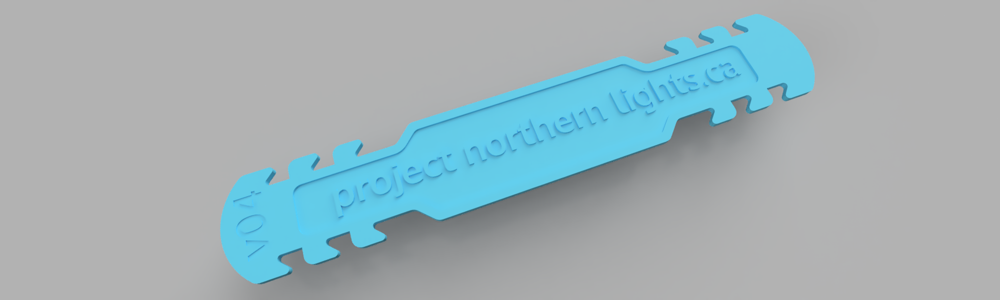
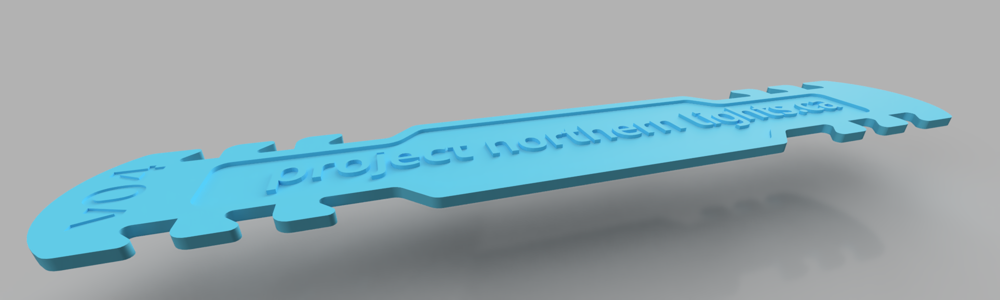
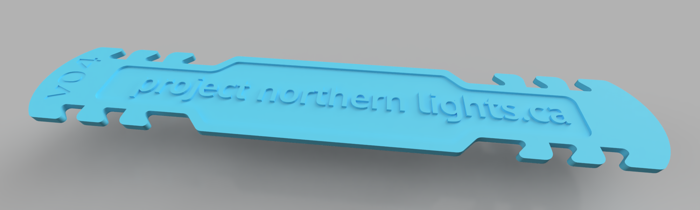

# Project Northern Lights' Ear Savers
====================================
#### A simple, 3d-printable ear saver design with branding for projectnorthernlights.ca 
---

---
#### Settings:
- Nozzle Diameter: 0.4mm (Match this to your printer's nozzle, most printers by default have a nozzel with 0.4mm diameter )
- Layer Height: 0.3mm (or 1.5)
- Infill: 100% 
- bottom layers: 2
- Top Layers: 3
---
The model is designed to be 5 layers at 0.3mm per layer and be completely solid. If you print with less top/bottomw layers or with thinner layers, set the infill to 100% for a completely solid print
